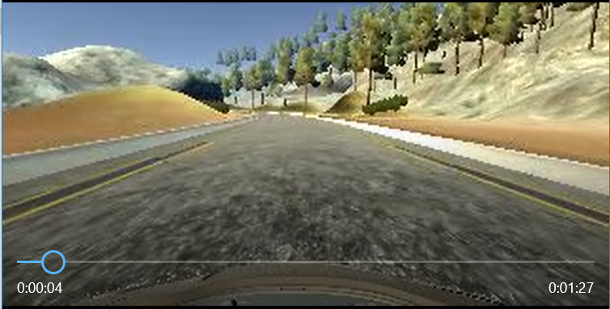

# **Behavioral Cloning** 

## Steering Angle Prediction from Cameras via Deep Convolutional Neural Networks

### Zikri Bayraktar, Ph.D. 

---

**Behavioral Cloning Project**

The goals / steps of this project are the following:
* Use the simulator to collect data of good driving behavior
* Build, a convolution neural network in Keras that predicts steering angles from images
* Train and validate the model with a training and validation set
* Test that the model successfully drives around track one without leaving the road
* Summarize the results with a written report


[//]: # (Image References)

[image1]: ./media/Histogram.png "Histogram"
[image2]: ./media/model_architecture.png "Model Architecture"
[image3]: ./media/sample_inputs.jpg "Sample Inputs"
[image4]: ./examples/placeholder_small.png "Recovery Image"

## Rubric Points
### Here I will consider the [rubric points](https://review.udacity.com/#!/rubrics/432/view) individually and describe how I addressed each point in my implementation.  

---
### Files Submitted & Code Quality

#### 1. Submission includes all required files and can be used to run the simulator in autonomous mode

My project includes the following files:
* [model.py](./model.py) containing the script to create and train the model
* [drive.py](./drive.py) for driving the car in autonomous mode
* [model.h5](./model.py) containing a trained convolution neural network 
* [readme.md](./readme), i.e. this file, summarizing the results, model selection and all other details.

#### 2. Submission includes functional code
Using the Udacity provided Unity simulator and my drive.py file, the car can be driven autonomously around the track by executing (Note that the training is completed and model saved with Keras version 1.2.1)
```sh
python drive.py model.h5
```

#### 3. Submission code is usable and readable

The [model.py](./model.py) file contains the code for training and saving the convolution neural network. The file shows the pipeline I used for training and validating the model, and it contains comments to explain how the code works.

### Model Architecture and Training Strategy

#### 1. CNN model architecture:

My model is a variation of the model proposed by NVIDIA in their paper ["End to End Learning for Self-Driving Cars"](http://images.nvidia.com/content/tegra/automotive/images/2016/solutions/pdf/end-to-end-dl-using-px.pdf).  (Figure below is modified version from the paper). My inputs to the network as RGB, which was different than the paper.

The input layer contains a lambda normalization function to normalize the input to (-0.5, 0.5) range.  Then it gets cropped 75 px from top and 20 px from bottom to eliminate the sky at top and car's hood at the bottom.

It contains four (4) convolutional layers followed by three (3) fully-connected dense layers. 
 
First three (3) convolutional layers are with 5x5 filter sizes and last conv layer 3x3 filter. The depths of each layers are 24, 36, 48, 64, respectively (model.py lines 115-130) 

All layers in the model has the RELU as the non-linear activation function, and the data is normalized in the model using a Keras lambda layer. 

#### 2. Attempts to reduce overfitting in the model

The model contains dropout layers in order to reduce overfitting. However, I realized that using dropout on all layers actually hinders the model performace, hence first two convolutional layers do not have dropout to be able to extract as many features as possible from the image.
Similarly, only the first dense layer has dropout and other layers do not.  

The model was trained and validated on different data sets to ensure that the model was not overfitting. The model was tested by running it through the simulator and ensuring that the vehicle could stay on the track.  A added a video to demonstrate that the simulator can drive the car autonomously on the first track.

#### 3. Model parameter tuning

The final model used an adam optimizer, so the learning rate was not tuned manually. However, I initially tried SGD optimizer and tried multiple learning rate values, which did not perform well. Thus in the final model, Adam optimizer is utilized.

For the kernel sizes and the number of filters, I mainly utilized the recommended values from the NVIDIA paper.

#### 4. Appropriate training data

I had to collect training data twice.  In my first attempt, I collected the data through the arrow keys on the keyboard. This approached turned out to be filled with many 0 degrees steering angles creating an unbalanced data set even with as many as 30k images.  

In the second data collection step, I used the mouse, which created a much better balanced dataset. 

I utilized the data provided by Udacity, combined with couple more runs that I did myself. I used a combination of center lane driving, recovering from the left and right sides of the road as well
as some special situations where the car kept moving off the road.  These places were simply parts of the road where no side lane were present, with dirt road nearby as well as the lake. I collected extra data in these situations where tried to recover returning the car back to the center from the edges of the road.  I also drove the car in the reverse direction to provide variety to the model.

In addition to the center camera images, I utilized both left and right images and augmented data by mirroring the center images.  This created a sufficiently large sized data set.
![sampleInputs][image3]


Above are some sample images of left, center and right images of the same instance. Each input images were size 160x320 px RGB.  Below is the histogram of the steering angle for all data set. It is a rather nice gaussian distribution of the data not like the first set where data was severely unbalanced.
![histogram][image1]

### Model Architecture and Training Strategy

#### 1. Solution Design Approach

Per the recommendation from the lecture, I started with the architecture from the NVIDIA paper.  This architecture was appropriate due to fact that it has been trained and tested on a similar task.  No need to invent the wheel here. 

Once I started training, I quickly realized that this network was quickly overfitting. Within first few iterations, validation error would start increasing again, while the training error kept reducing. This was clear indication of overfitting. 

To tackle the overfitting, I removed the very last convolutional layer. After few training attempts, I checked my data set. It turned out that my initial attempt to collect data through the arrow keys on the keyboard caused a massive dataset which was unbalanced. To elaviate the problem, I recollected the data as explained above using the mouse. This created a nice looking gaussian distribution and was sufficient for the task.

I also added dropout layers after every layer. This hindered the performance of the network where the car kept driving off the road. Then, I started removing dropout layers one by one. First, I removed after the first convolutional layer. As we know, first conv layer learns the small features in the images. By forcing a dropout, I was removing some of the small but important features.  Then, I removed the dropout from second conv layer and it kept imroving.  I tried couple of different combination and settled on the current architecture which achieved the task.

The final step was to run the simulator to see how well the car was driving around track one. There were a few spots where the vehicle fell off the track.  The car went off the road into the lake, hit the side walls on the bridge and went off the dirt road.  To improve the driving behavior in these cases, I ran the simulator and collected data in those cases where I intentionally drove the car slightly off the road and recovered it back to center to capture this behavior.

At the end of the process, the vehicle is able to drive autonomously around the first track without leaving the road.

#### 2. Final Model Architecture

The final model architecture (model.py lines 115-130) consisted of a convolution neural network with 4 convolutional layers and 3 fully connected dense layers as explained above.  Here is a visualization of the architecture (note that I edited the image from NVIDIA paper) 

![model_image][image2]

### FINAL VIDEO

and here is the video of my model driving the car on track 1. Car never leaves the road :)
(Click on the thumbnail to view video on a new window)

[](./video.mp4)